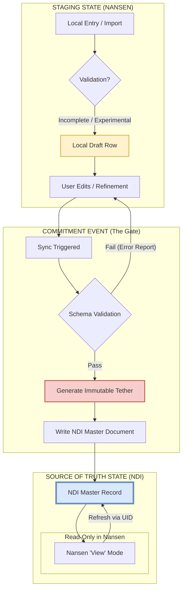

# Architectural Redesign: NANSEN-NDI Integration

This document outlines the ground-up architectural redesign of the integration between the NANSEN framework and the NDI-matlab database, moving from a name-based "Guess-and-Check" matching system to a robust **State-Based Lifecycle** model.

## 1. Architecture Map: The Data Lifecycle

The following diagram illustrates the lifecycle of a metadata record from its creation as a local draft in Nansen to its promotion as a Master record in NDI.

---

## 2. The "Tether" Strategy: Bi-Directional Immutable Linking

To eliminate the fragility of name-based matching, we implement an **Immutable Tether** (UID) that decouples the relationship from the metadata content.

*   **Birth of the Tether:** Every record created in the Nansen Staging State is immediately assigned a `Nansen_UUID`. This ID is purely internal to Nansen and never changes, even if the user renames a session or changes a subject's ID.
*   **The Commitment Link:** During the Sync Event, when an NDI document is created, two things happen:
    1.  The `Nansen_UUID` is written into a specific property of the NDI document (e.g., `nansen.local_id`).
    2.  The NDI `base.id` (the database's own immutable UUID) is returned and stored in the Nansen table row as the `NDI_Document_ID`.
*   **Decoupled Sync:** Subsequent synchronizations use the `NDI_Document_ID` as the primary key. If a user changes a Subject's "Cage ID" in Nansen, the system doesn't "search" for a matching cage; it simply tells NDI: *"Update the document with ID 'XYZ' to have Cage ID 'ABC'."*
*   **View-Mode Integrity:** When Nansen displays a committed record, it performs a "Just-In-Time" refresh from NDI using the tether. If the record exists in NDI, the local Nansen table is treated as a temporary cache of the NDI Master.

---

## 3. Ontology Handling: Schema Promotion

To allow for experimental flexibility without database rigidity, we treat Nansen as an **Ontology Incubator**.

*   **Dynamic Staging Columns:** Users can add arbitrary columns to Nansen tables in the Staging state. These are stored locally as standard MATLAB table variables.
*   **The "Promotion" Logic:** During the Sync Event, the system identifies columns that do not match the standard NDI core schema. Instead of ignoring them or breaking the sync, these are packed into an NDI `ontology_blob` or a series of `generic_metadata` documents linked to the main record.
*   **Self-Describing Metadata:** Each promoted field includes metadata about itself (Type, Units, Label).
*   **Promotion to "Standard":** If a specific "Experimental" column becomes standard across the lab, a "Promotion Task" can be run to migrate that specific key from the `generic_metadata` blob into a first-class property of a specialized NDI Document class, without ever losing the UID tether.
*   **Reflection:** When Nansen pulls data back from NDI, it unpacks the `generic_metadata` blob back into table columns, ensuring the GUI remains a perfect reflection of the database's flexible storage.
