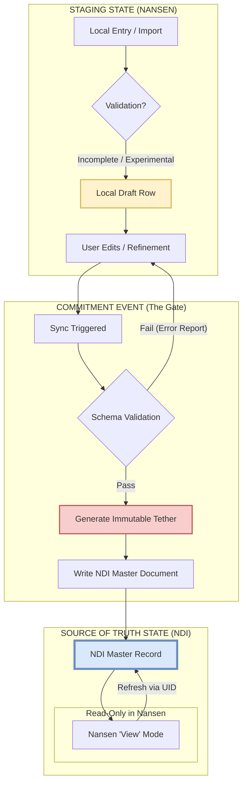

# Architectural Redesign: NANSEN-NDI Integration

This document outlines the ground-up architectural redesign of the integration between the NANSEN framework and the NDI-matlab database, moving from a name-based "Guess-and-Check" matching system to a robust **State-Based Lifecycle** model.

## 1. Architecture Map: The Data Lifecycle

The following diagram illustrates the lifecycle of a metadata record from its creation as a local draft in Nansen to its promotion as a Master record in NDI.

---

## 2. The 4-Tier Ownership Hierarchy

The integration follows a strict hierarchical ownership model to ensure temporal and structural integrity across datasets.

*   **Tier 1: Dataset** (The Global Project/Root).
*   **Tier 2: Session** (The Recording Event/Timepoint). The Session is the primary parent of the recording data.
*   **Tier 3: Subject** (The Animal/Entity). A Subject is owned by a Session for the duration of that recording event.
*   **Tier 4: Files & Metadata**. These are linked directly to the Subject UID within the context of its parent Session.

This structure allows the same Subject to exist across multiple Sessions as distinct NDI records while maintaining their unique temporal metadata.

---

## 3. The "Tether" Strategy: Bi-Directional Immutable Linking

To eliminate the fragility of name-based matching, we implement an **Immutable Tether** (UID) that decouples the relationship from the metadata content.

*   **Birth of the Tether:** Every record created in the Nansen Staging State is immediately assigned a `Nansen_UUID`. This ID is purely internal to Nansen and never changes, even if the user renames a session or changes a subject's ID.
*   **The Commitment Link:** During the Sync Event, when an NDI document is created, two things happen:
    1.  The `Nansen_UUID` is written into a specific property of the NDI document (e.g., `nansen.local_id`) using standardized `ndi.document` constructors.
    2.  The NDI `base.id` (the database's own immutable UUID) is returned and stored in the Nansen table row as the `NDI_Document_ID`.
*   **Decoupled Sync:** Subsequent synchronizations use the `NDI_Document_ID` as the primary key. If a user changes a Subject's "Cage ID" in Nansen, the system doesn't "search" for a matching cage; it simply tells NDI: *"Update the document with ID 'XYZ' to have Cage ID 'ABC'."*
*   **Real-World Integration Rules:** To maintain system integrity, the following rules must be followed:
    1.  **Framework Methods Only:** All metadata updates must be performed via the Nansen `metaTable.editEntries` method. Raw table assignments are prohibited to prevent GUI desync or metadata corruption.
    2.  **NDI Document Registration:** Documents must be created using the official `ndi.document` class and registered using the NDI session's `database_add` method.
    3.  **Naming Consistency:** Discovery and parsing of session/subject metadata must utilize the repository's established regex patterns (e.g., those found in `subjectInfoFromFile.m`).
*   **Hierarchical Tethering:** Relationships are persisted via parent-child UIDs in a specific sequence:
    1.  **Session UID** is generated/verified first.
    2.  **Subject UID** is established as a child of the Session.
    3.  **File UID** is established as a child of the Subject.
    This ensures that even if a Subject (e.g., 'Animal_A') appears in multiple sessions, each instance is tethered to the correct temporal parent.
*   **View-Mode Integrity:** When Nansen displays a committed record, it performs a "Just-In-Time" refresh from NDI using the tether. If the record exists in NDI, the local Nansen table is treated as a temporary cache of the NDI Master.

---

## 4. Ontology Handling: Strict Schema Mapping

To ensure NDI remains a standardized, "clean" source of truth, the integration uses **Strict Schema Mapping**. Nansen acts as a flexible incubator, but the database only accepts validated data.

*   **Dynamic Staging Columns:** Users can add arbitrary columns to Nansen tables in the Staging state for local analysis or temporary notes.
*   **The Validation Gate:** During the Commitment/Sync Event, every Nansen column is checked against a **Mapping Registry**.
    *   **Mapped Fields:** Columns with a defined mapping are translated into specific NDI document properties.
    *   **Unmapped Fields:** Any column without a corresponding NDI property is flagged. The sync is paused, and the user must either:
        1.  **Map it:** Define a new relationship between the Nansen column and an NDI class property.
        2.  **Skip it:** Explicitly exclude the column from the database synchronization.
*   **No Unstructured Blobs:** "Catch-all" metadata blobs are prohibited. All data in NDI must conform to the formal schema of its document class.
*   **Promotion to Database:** When a new metadata type is required, it is first defined in the NDI schema. Once the mapping is registered in Nansen, the data can be "promoted" from the staging table to the database.
*   **Consistent Reflection:** Nansen’s "View" mode only displays properties that are explicitly defined in the NDI Master document, ensuring the user sees exactly what is persisted in the source of truth.
